# WADF105 Practical Laboratory 1

**Two VM Network Commissioning and Connectivity Verification**

## Overview

This repository holds my evidence report for Practical Laboratory 1. The lab builds a small protected network from two VirtualBox virtual machines, then verifies addressing, routing, name resolution and internet access, and observes ARP, ICMP and DNS traffic in Wireshark.

All work was done inside the authorized ICDFA laboratory environment.

## Contents

```
README.md
WADF105_Lab_01_Evidence_Report.pdf
lab1_evidence/
```

- `README.md`: this file.
- `WADF105_Lab_01_Evidence_Report.pdf`: the full report with a summary of results, screenshots E1 to E7 with captions, answers to the five completion questions, and a troubleshooting appendix.
- `lab1_evidence/`: the screenshot images shown below.

## Lab environment

```
Hypervisor : Oracle VirtualBox
Firewall   : OPNsense 26.7 (amd64), VM "icdfa-nslab-firewall-v1"
Client     : Ubuntu desktop, VM "icdfa-nslab-client-v1"
Tools      : Wireshark, ip, resolvectl, getent, curl, ping
```

## Topology

```
   Internet
      |
  VirtualBox NAT (gateway 10.0.2.2)
      |
  [em0 WAN 10.0.2.15/24, DHCP]
  +--------------------------+
  |   OPNsense firewall      |
  +--------------------------+
  [em1 LAN 10.10.10.1/24]
      |
  Internal Network "ICDFA-LAN"  (virtual switch)
      |
  [enp0s3 10.10.10.237/24, DHCP]
  +--------------------------+
  |   Ubuntu client          |
  +--------------------------+
  default gateway 10.10.10.1, DNS 10.10.10.1
```

## Addressing

| Item | Value |
|---|---|
| Firewall WAN (em0) | 10.0.2.15/24 via DHCP, upstream gateway 10.0.2.2 |
| Firewall LAN (em1) | 10.10.10.1/24 static, DHCP range .100 to .200 |
| Ubuntu client (enp0s3) | 10.10.10.237/24 via DHCP |
| Firewall LAN MAC | 08:00:27:48:41:99 |
| Ubuntu client MAC | 08:00:27:ff:8a:c6 |

The internal network name `ICDFA-LAN` is case-sensitive and must match on both the firewall LAN adapter and the client adapter.

## Results

| Test | Command | Result |
|---|---|---|
| 1 | `ping -c 4 10.10.10.1` | 4/4 replies, 0% loss (gateway reachable) |
| 2 | `ping -c 4 1.1.1.1` | 4/4 replies, 0% loss (routing and NAT work) |
| 3 | `getent hosts opnsense.org` | Address returned (DNS works) |
| 4 | `curl -I https://opnsense.org` | HTTP headers received (301 redirect) |

Wireshark capture on enp0s3 showed:

- ARP request "Who has 10.10.10.1?" and the reply giving the firewall MAC
- ICMP echo request and reply pairs between the client and 10.10.10.1
- DNS queries from the client to 10.10.10.1 and their responses

## Evidence

### E1: VirtualBox network settings for OPNsense

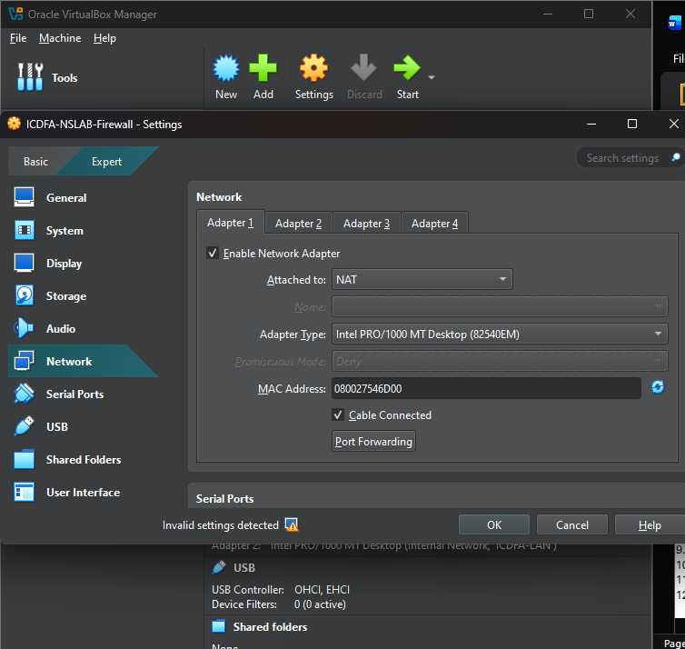

*Adapter 1 of the OPNsense firewall VM is attached to NAT with the cable connected, providing the WAN path to the internet.*

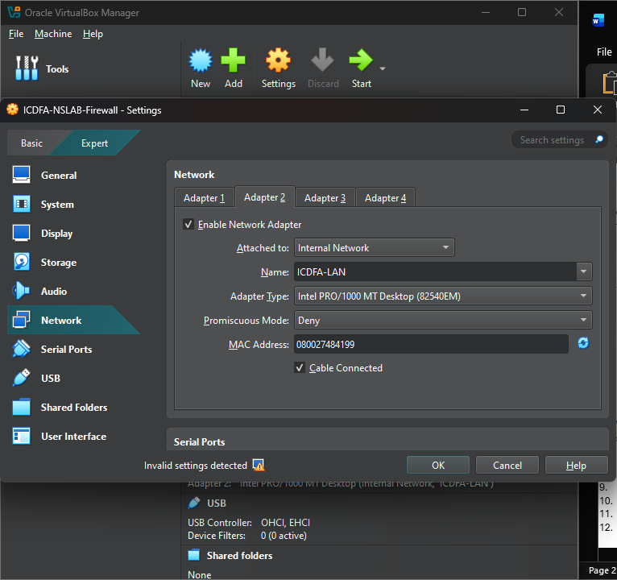

*Adapter 2 of the OPNsense firewall VM is attached to Internal Network ICDFA-LAN with the cable connected, forming the protected LAN.*

### E2: VirtualBox network settings for Ubuntu

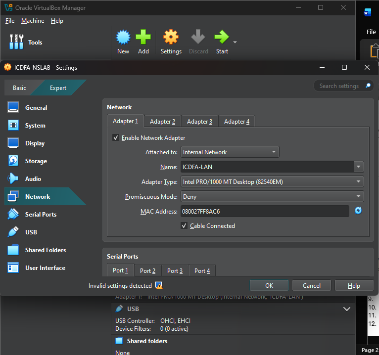

*The Ubuntu client has Adapter 1 attached to Internal Network ICDFA-LAN, the same network name as the firewall LAN adapter.*

### E3: OPNsense WAN and LAN addresses

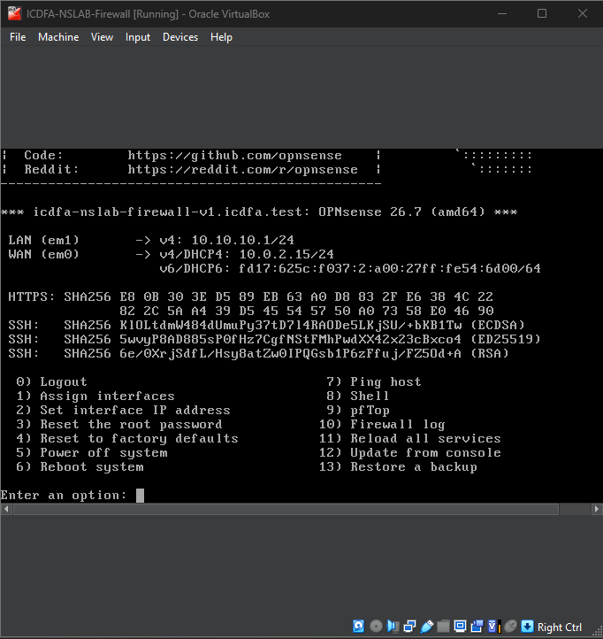

*The OPNsense console shows LAN (em1) at 10.10.10.1/24 and WAN (em0) at 10.0.2.15/24 obtained by DHCP.*

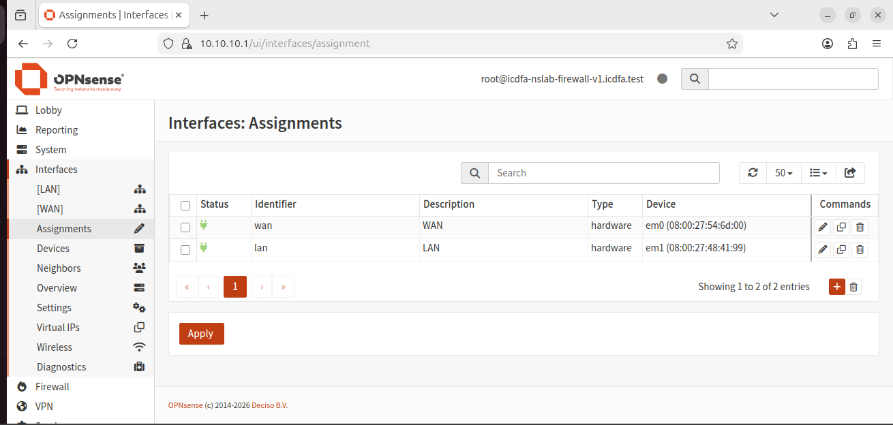

*The OPNsense Interfaces: Assignments page confirms wan is on em0 and lan is on em1, with their MAC addresses.*

### E4: Ubuntu addressing and routing

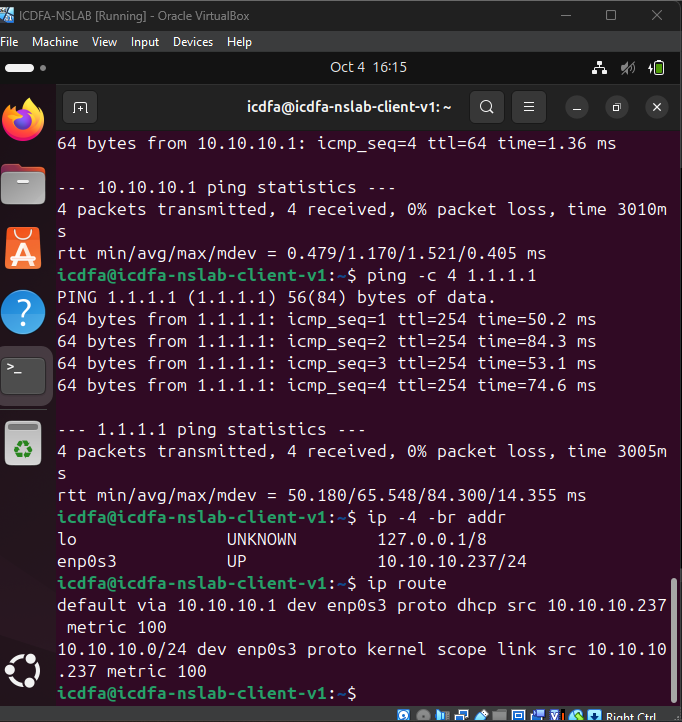

*The output of `ip -4 -br address` shows enp0s3 at 10.10.10.237/24, and `ip route` shows the default route via 10.10.10.1 learned by DHCP.*

### E5: Gateway, internet and DNS tests

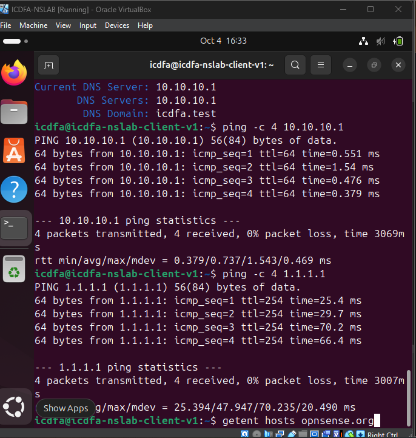

*Pings to the gateway 10.10.10.1 and to 1.1.1.1 both succeed with 0% packet loss, proving local reachability, routing and outbound NAT.*

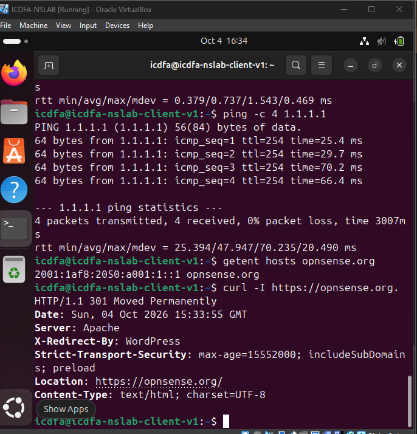

*`getent hosts opnsense.org` returns an address and `curl -I https://opnsense.org` returns HTTP headers, proving DNS resolution and web connectivity.*

### E6: Wireshark ARP, ICMP and DNS

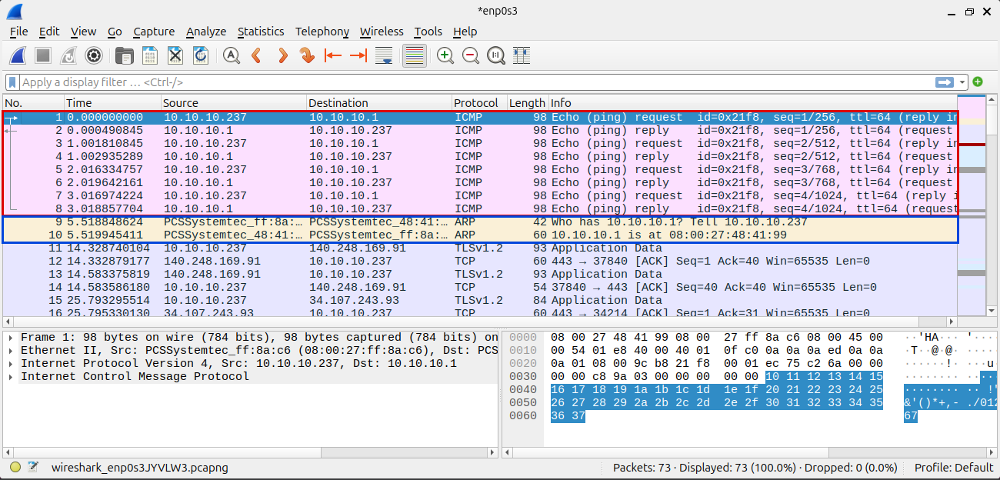

*The capture on enp0s3 shows the ICMP echo request and reply pairs in packets 1 to 8 (red outline) and the ARP request "Who has 10.10.10.1?" with the reply "10.10.10.1 is at 08:00:27:48:41:99" in packets 9 and 10 (blue outline).*

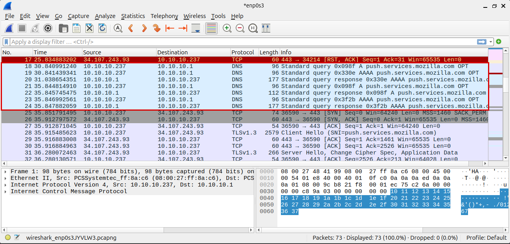

*DNS queries from 10.10.10.237 to the firewall resolver 10.10.10.1 and their matching responses appear in packets 18 to 24 (red outline).*

### E7: Why the client uses 10.10.10.1 as its default gateway

E7 is a written paragraph and is in the PDF report. In short, 10.10.10.1 is the OPNsense LAN interface and the only router on the 10.10.10.0/24 network, so the client sends traffic for any outside destination to it and the firewall forwards it out through the WAN with NAT.

## Troubleshooting notes

1. **Client had no IPv4 address.** dhclient was not installed on the client, so the lease was renewed with `sudo systemctl restart NetworkManager`.

   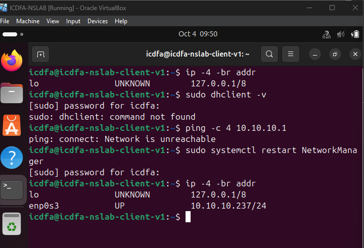

   *The client initially had no IPv4 address on enp0s3; after restarting NetworkManager it obtained 10.10.10.237/24.*

2. **Ping to 1.1.1.1 returned "Destination Host Unreachable" from 10.10.10.1.** The firewall routing table had no default route.

   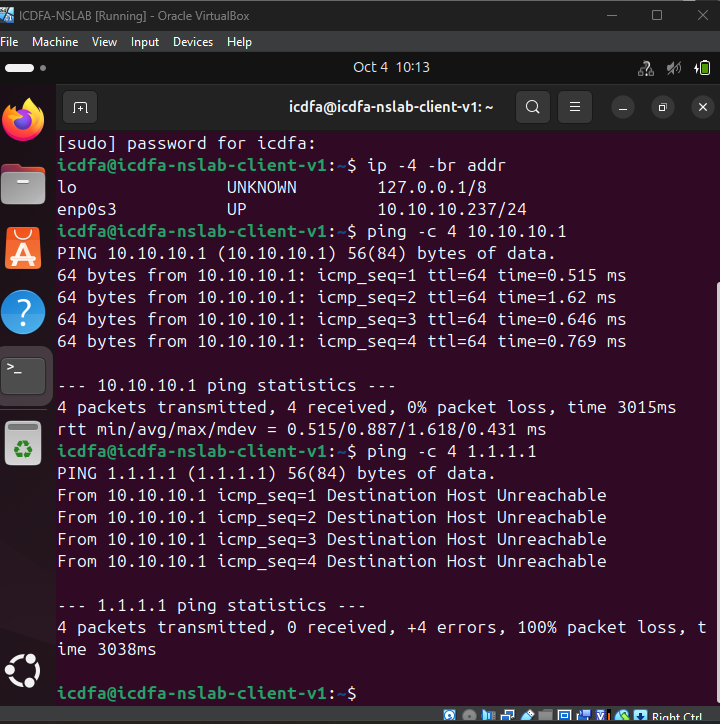

   *The gateway ping succeeded, but the ping to 1.1.1.1 returned "Destination Host Unreachable" from 10.10.10.1, showing the firewall had no usable route to the internet.*

   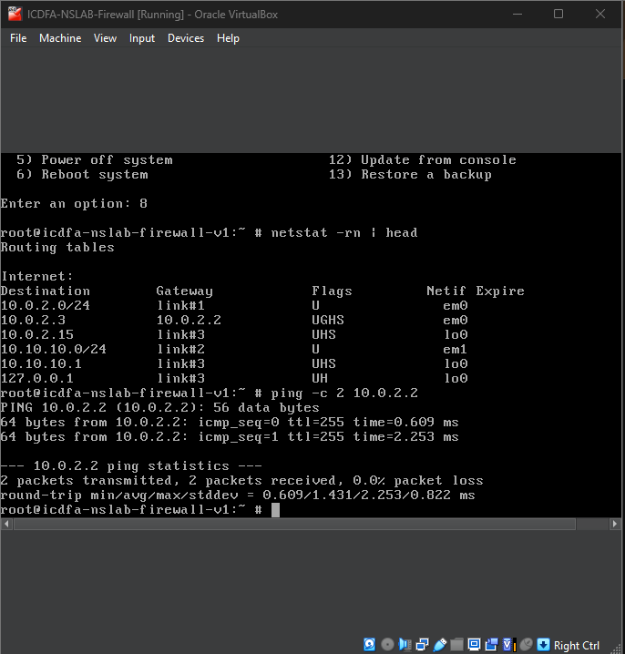

   *On the firewall, `netstat -rn` showed no default route at this point, while the upstream gateway 10.0.2.2 answered pings, so the WAN link itself was working.*

   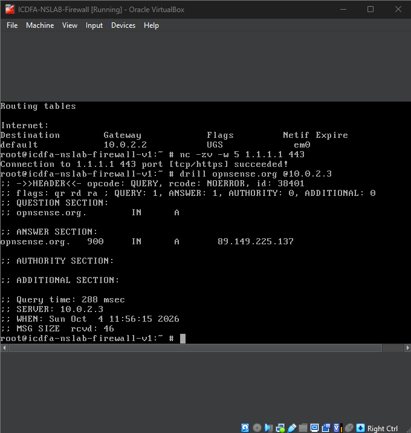

   *Once the default route via 10.0.2.2 on em0 was in place, the firewall made a TCP connection to 1.1.1.1 port 443 and resolved opnsense.org through the VirtualBox resolver.*

   Checking the table with `netstat -rn` and testing the WAN side (ping 10.0.2.2, TCP to 1.1.1.1:443, DNS lookup) showed the WAN link itself was healthy. Once the default route via 10.0.2.2 on em0 was present, internet access worked from both VMs.

3. **Interface roles.** VirtualBox Adapter 1 (NAT) and Adapter 2 (ICDFA-LAN) must be assigned to the matching OPNsense roles (WAN on the NAT adapter, LAN on ICDFA-LAN). Check this under Interfaces > Assignments or console option 1.

Useful checks: `ip -br link`, `ip -4 -br address`, `ip route`, `resolvectl status`, and `netstat -rn` (on the firewall shell).
