# WADF105 Practical Laboratory 2: OPNsense Firewall Policy Testing

This repository contains the laboratory report and evidence for Practical Laboratory 2: OPNsense Firewall Policy Testing, Logging and Packet Analysis.

## Lab objective

The laboratory demonstrates controlled firewall policy testing using an authorized OPNsense firewall and Ubuntu client. The work covers baseline connectivity, narrow firewall blocks, logging, packet capture, state inspection, and restoration of normal connectivity.

## Lab environment

```
Firewall VM       : icdfa-nslab-firewall-v1
Client VM         : icdfa-nslab-client-v1
OPNsense LAN      : 10.10.10.1/24
Ubuntu client     : 10.10.10.237
Client interface  : enp0s3
Default gateway   : 10.10.10.1
WAN attachment    : VirtualBox NAT
Outbound NAT      : Automatic
```

## Test rules

**1. LAB2 BLOCK ICMP TO 1.1.1.1**

```
Action       : Block
IP version   : IPv4
Protocol     : ICMP
Source       : LAN net
Destination  : 1.1.1.1/32
Logging      : Enabled
```

**2. LAB2 BLOCK OUTBOUND HTTP**

```
Action           : Block
Protocol         : TCP
Source           : LAN net
Destination      : Any
Destination port : HTTP / 80
Logging          : Enabled
```

The specific block rules must be placed above the broad "Default allow LAN to any" rule because OPNsense processes interface rules from top to bottom and the first match wins.

## Evidence included

### E1: Successful baseline ping, DNS, HTTP and HTTPS tests

Before any rule was created, the client had its address and default route, and all four baseline tests worked.

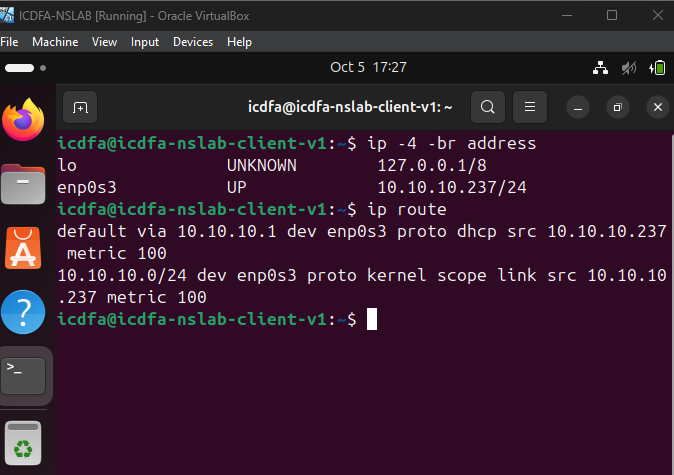

*The client has 10.10.10.237/24 on enp0s3 and a default route via the firewall at 10.10.10.1.*

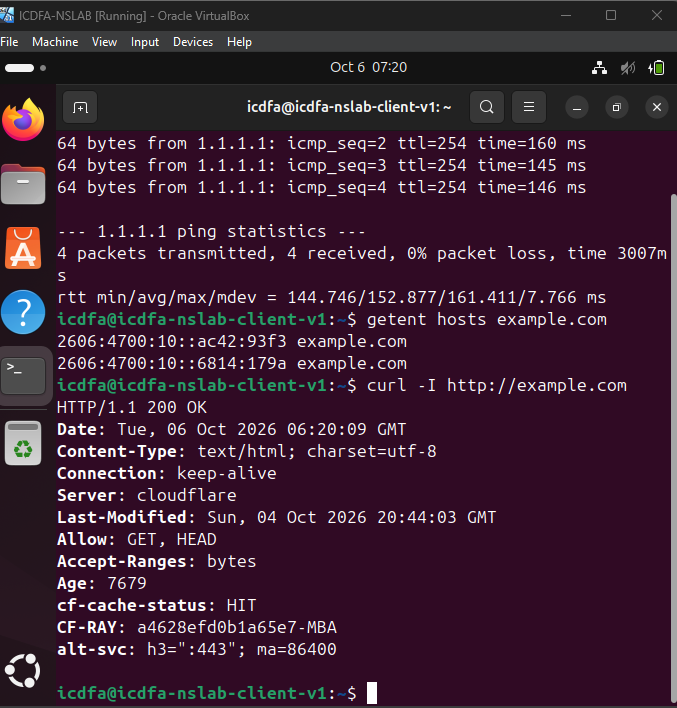

*The ping to 1.1.1.1 gets four replies with 0% loss, getent resolves example.com, and curl over HTTP returns 200 OK.*

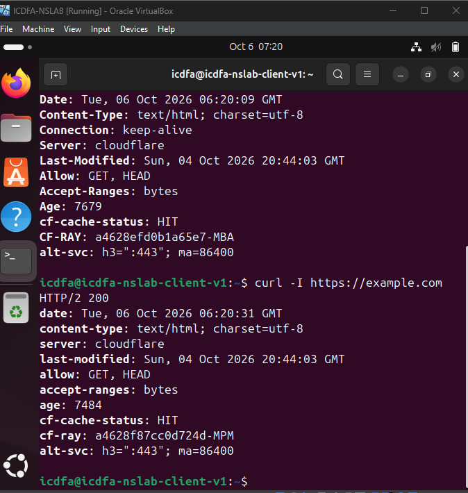

*curl over HTTPS returns HTTP/2 200, completing the baseline.*

### E2: OPNsense LAN rule evidence for the two LAB2 block rules

*Screenshot to be added: the Firewall > Rules > LAN page with both LAB2 rules enabled and listed above "Default allow LAN to any".*

### E3: Failed ICMP test with successful DNS/HTTPS evidence

With the ICMP rule active, ping is blocked but name resolution and HTTPS still work.

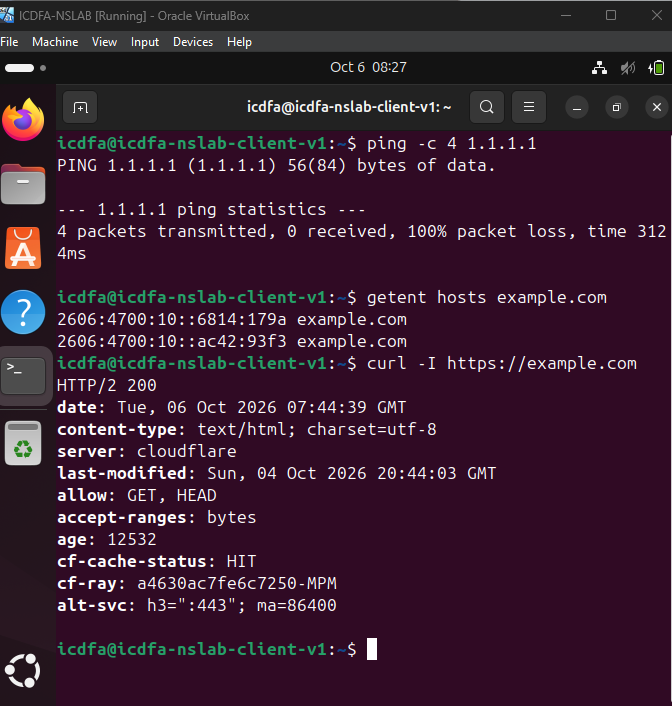

*The ping to 1.1.1.1 shows 100% packet loss while getent and curl over HTTPS both succeed, so only ICMP is filtered.*

### E4: Failed HTTP test with successful HTTPS evidence

With the HTTP rule active, port 80 is blocked but port 443 is not.

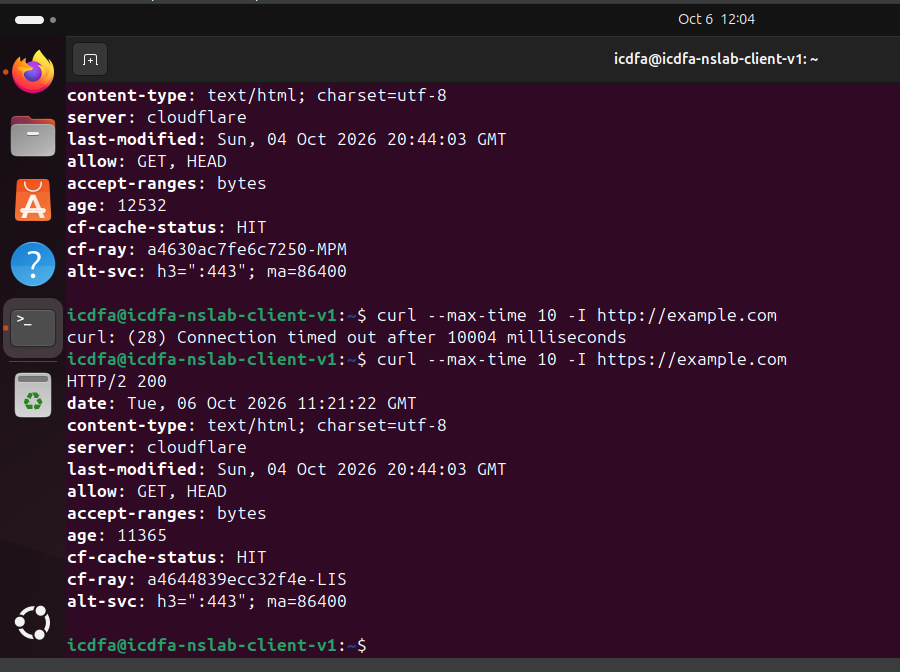

*curl over HTTP times out after about 10 seconds while curl over HTTPS returns HTTP/2 200.*

### E5: OPNsense Live View evidence for blocked ICMP and TCP port 80 traffic

The firewall log, filtered on LAB2, shows its own record of the blocked traffic.

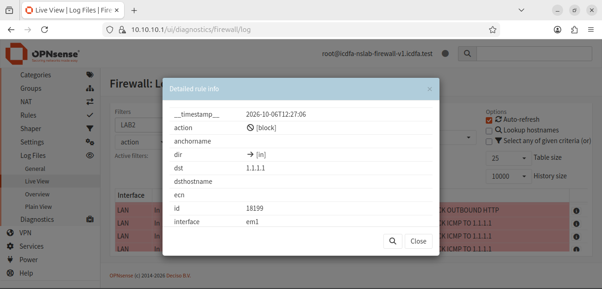

*A Live View entry shows action block, direction in, destination 1.1.1.1 on the LAN interface (em1), with the LAB2 ICMP and HTTP block entries listed behind it.*

### E6: Wireshark evidence for blocked ICMP/HTTP and permitted HTTPS traffic

Packets were captured on the client interface enp0s3, so they show what the client sent and what came back. Each screenshot has its display filter visible.

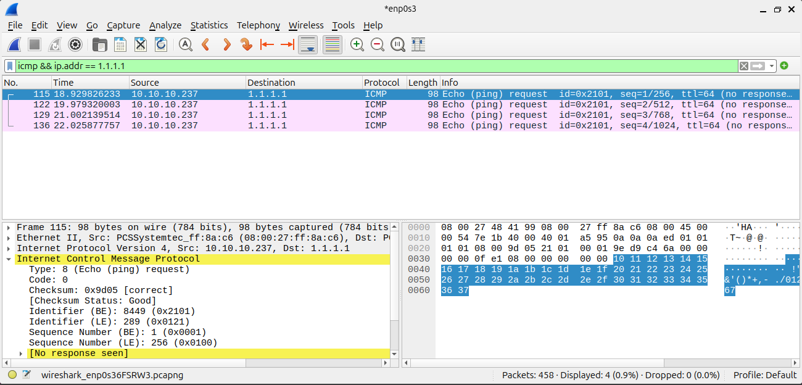

*Filter `icmp && ip.addr == 1.1.1.1` shows four echo requests and no replies.*

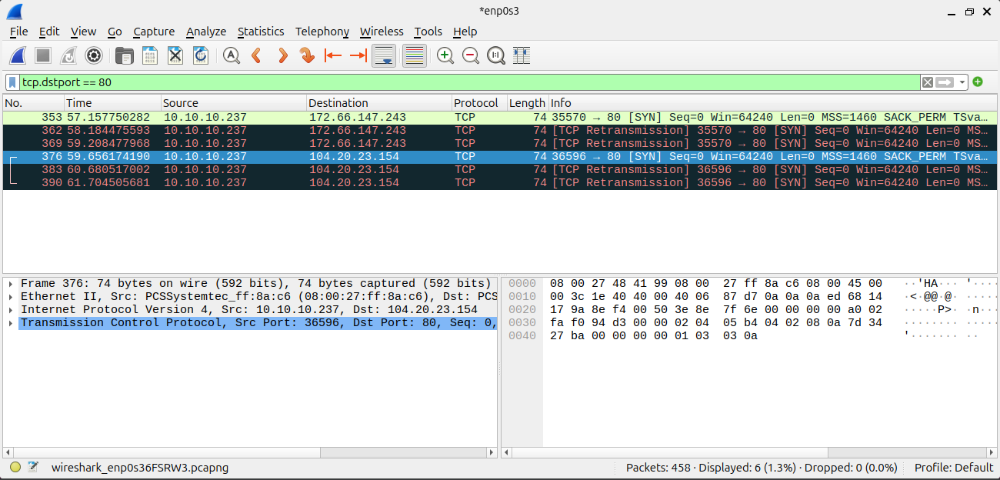

*Filter `tcp.dstport == 80` shows SYN packets sent and retransmitted with no handshake completing.*

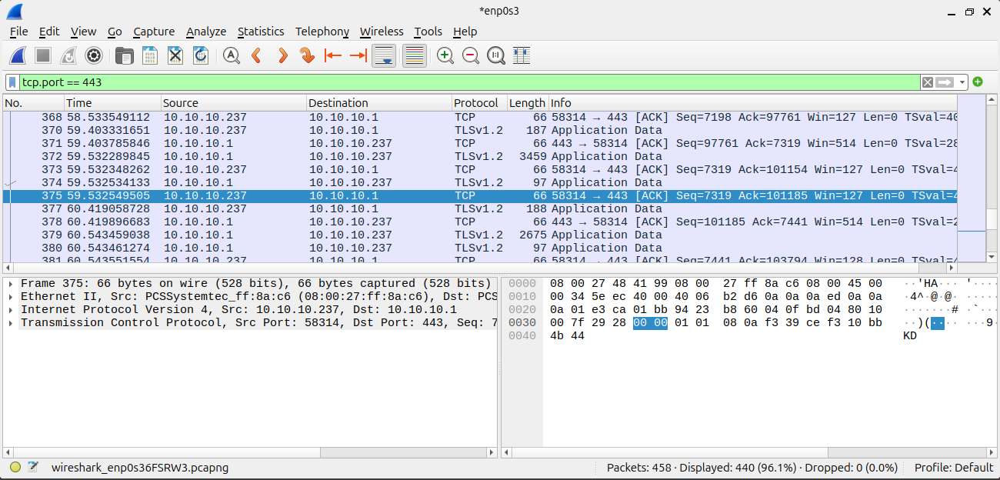

*Filter `tcp.port == 443` shows port 443 traffic completing normally with TLS application data; the session visible here is the client's connection to the firewall web interface at 10.10.10.1.*

### E7: OPNsense state-table evidence for a permitted HTTPS connection

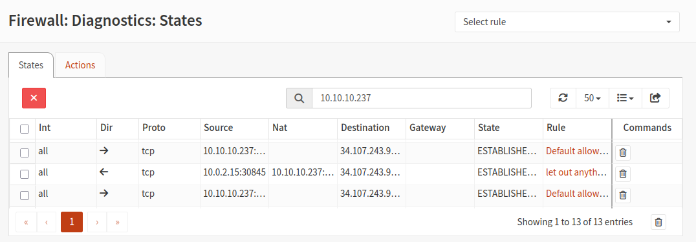

*The state table filtered to 10.10.10.237 shows established outbound TCP connections allowed by "Default allow LAN to any", with a WAN-side row showing the translated source address 10.0.2.15.*

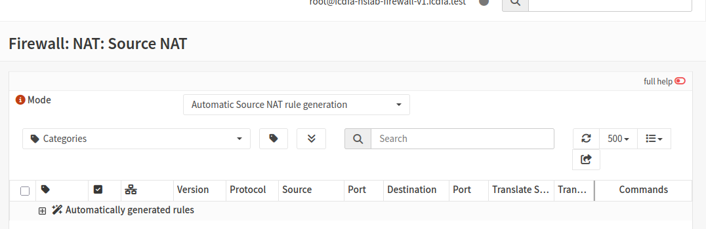

*Firewall > NAT > Source NAT is set to Automatic Source NAT rule generation, which translates the client's private address for outbound traffic.*

### E8: Restored connectivity and final firewall state evidence

Both test rules were disabled, not deleted, and the baseline tests were repeated.

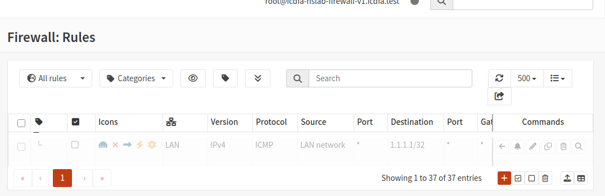

*The ICMP rule for 1.1.1.1/32 is shown greyed out in the LAN rules list, meaning it is disabled.*

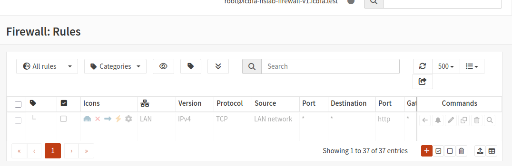

*The TCP port 80 (http) rule is shown greyed out in the LAN rules list, meaning it is disabled.*

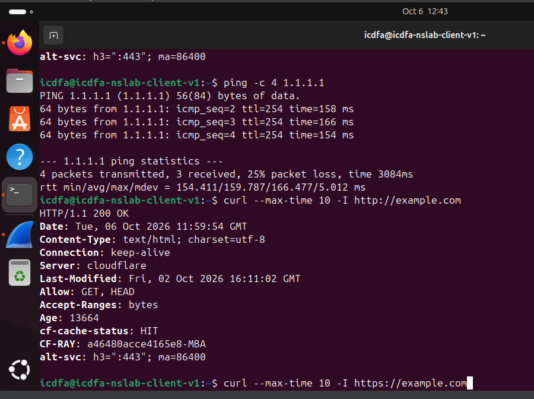

*After the rules were disabled, ping to 1.1.1.1 receives replies again (three of four) and curl over HTTP returns 200 OK.*

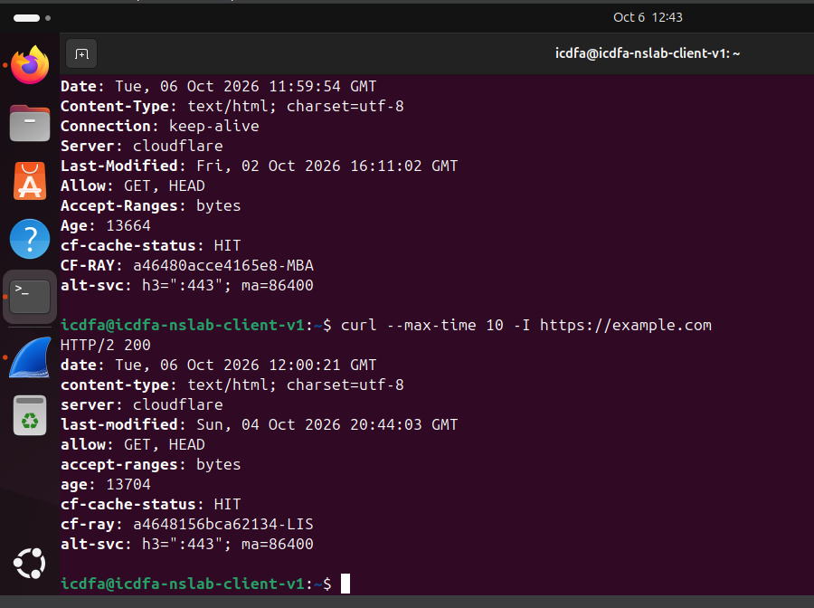

*curl over HTTPS still returns HTTP/2 200, confirming normal connectivity is restored.*

## Repository files

```
README.md
WADF105_Lab_02_Evidence_Report.pdf
lab2_evidence/
```

The PDF document is the main submission report and contains the evidence screenshots with captions. The `lab2_evidence/` folder holds the screenshot images shown in this README.
